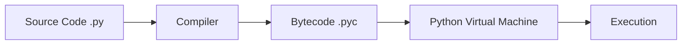

# Introduction to Python 🐍

Python is a high-level, interpreted, general-purpose programming language. Created by **Guido van Rossum** and first released in 1991, Python's design philosophy emphasizes code readability with its notable use of significant indentation.


## Why is Python so popular?

Over the past decade, Python has dominated the programming world. Here are the primary reasons why:

1. **Readable and Maintainable Code:** Python’s syntax is clean and concise. It relies heavily on indentation rather than curly braces or semicolons, making it look almost like plain English.
2. **Multiple Programming Paradigms:** Python supports object-oriented, imperative, and functional programming or procedural styles.
3. **Robust Standard Library:** It ships with a massive standard library, often described as "batteries included," which provides tools for web programming, string operations, internet protocols, and much more out of the box.
4. **Vast Ecosystem:** Frameworks like Django and Flask (web development), Pandas and NumPy (data science), and TensorFlow and PyTorch (AI/Machine Learning) make Python the go-to language for nearly every modern computing field.

> [!NOTE]
> Python is currently the most popular language for Artificial Intelligence and Machine Learning due to the massive community and heavily optimized math libraries written in C that run under the hood.

---

## Python Execution Model

Unlike compiled languages like C or C++, Python is an **interpreted** language. 

When you run a Python script, the CPython interpreter (the standard implementation of Python) performs the following steps:
1. **Compilation:** It compiles your source code (`.py`) into an intermediate format called **bytecode** (`.pyc`).
2. **Execution:** It feeds this bytecode into the Python Virtual Machine (PVM), which executes the instructions one by one.



This model makes Python highly portable—you can write a Python script on a Mac and run it on Windows or Linux without changing a single line of code!

---

## Hello, World!

Let's look at the traditional "Hello, World!" program in Python:

```python
print("Hello, World!")
```

That's it! There are no `public static void main` declarations, no header file inclusions, and no memory allocations. The `print()` function is a built-in function that writes the string provided to the standard output.

### Using Python as a Calculator

Python's REPL (Read-Eval-Print Loop) makes it an excellent interactive calculator:

```python
# Addition
print(5 + 3)        # 8

# Exponentiation (5 to the power of 3)
print(5 ** 3)       # 125

# Floor Division (Returns integer quotient)
print(17 // 3)      # 5

# Modulo (Returns remainder)
print(17 % 3)       # 2
```

---

## The Zen of Python

Python's guiding principles are famously captured in an Easter egg called **"The Zen of Python"**. If you open a Python interpreter and type `import this`, you will see a poem by Tim Peters outlining the philosophy of the language:

> *Beautiful is better than ugly.*
> *Explicit is better than implicit.*
> *Simple is better than complex.*
> *Complex is better than complicated.*
> *Flat is better than nested.*
> *Sparse is better than dense.*
> *Readability counts.*

---

## Up Next

Now that you know what Python is and how it runs, let's dive into **Variables and Data Types** in the next lesson to learn how Python manages memory dynamically!
